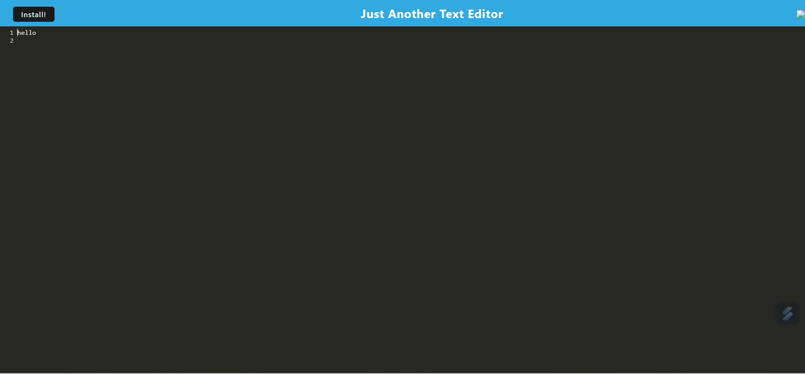

# Text Editor application
  
  ## Description
  This is a single page text editor application that runs in the browser. It is functional both online and offline, and features various data persistence techniques so that the function remains even if one of the technique is not supported by the browser. The application was built from an existing application where the developer implemented methods for retrieving and storing data to IndexedDB database.
  Below is a screenshot of the application running in the browser:
  
  ## Table of Contents
  - [Description](#description)
  - [Usage](#usage)
  - [Installation](#installation)
  - [Contributing](#contributing)
  - [Questions](#questions)
  ## Usage
  Use this application to create notes or code snippets, with or without internet connection. The user input will be automatically saved with IndexedDB when the user click off of the DOM window. When user reopen the text editor after closing the browser, the saved content will be repopulated in the text field.
  User can also download the application onto their local computer, appearing as an icon on their desktop.
  ## Installation
  Run the application with the command 'npm run start' from the root directory. This will start up the backend and serve the client. The Text editor requires Webpack, Babel, Concurrently and Nodemon packages. To install all relevant packages, run the command 'npm run install' from the root directory, this will automatically run the installation for client and server directory.
  ## Contributing
  If you would like to contribute to this project, head to my GitHub page to see details of the application code. You can also contact me via my email below for any suggestions and feedback.
  ## Questions
  Check out my projects on my GitHub account at https://github.com/Sandy5433
  . If you have any questions about the application, you can reach me via my email at sandyhung83@yahoo.com.tw 
  